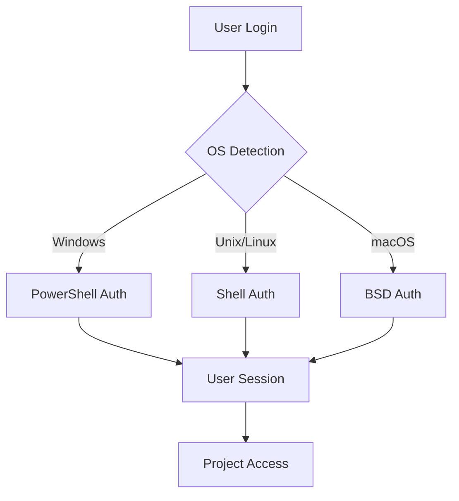

# 🚀 Claude Code Web UI - Enterprise Edition

[](https://www.typescriptlang.org/)
[](https://reactjs.org/)
[](https://hono.dev/)
[](https://nodejs.org/)
[](https://opensource.org/licenses/MIT)

> **🌟 The most advanced web interface for Claude Code CLI with enterprise-grade security, multi-user authentication, and cross-platform support**

<div align="center">

**[📖 Documentation](#-comprehensive-features) • [🚀 Quick Start](#-quick-start-installation) • [🔐 Security](#-enterprise-security) • [💻 Demo](#-screenshots--demo) • [🔧 Development](#-development)**

</div>

---

## 🎯 **Why Choose Our Claude Code Web UI?**

Transform your development workflow with the most feature-rich, secure, and user-friendly Claude Code web interface available.

<div align="center">

| 🎨 **Ultra Modern Design** | 🔐 **Enterprise Security** | 🌍 **Cross-Platform** | 👥 **Multi-User Ready** |
|:--:|:--:|:--:|:--:|
| Glass effects, gradients, responsive UI | Rate limiting, authentication, input validation | Windows 11, Linux, macOS, Unix | User switching, role management |

</div>

### ✨ **What Sets Us Apart**

- **🔐 Multi-User Authentication** - Shell user login with Windows 11 & Unix support
- **🛡️ Enterprise Security** - Rate limiting, failed login tracking, comprehensive input validation
- **👑 User Management** - Root/Administrator user switching with privilege detection
- **🎨 Ultra Modern UI** - Glass morphism, gradient animations, mobile-responsive design
- **📁 Advanced Project Management** - Visual project creation, configuration, file operations
- **🔧 Developer Experience** - TypeScript throughout, API-first architecture, comprehensive logging

---

## 📸 **Screenshots & Demo**

<div align="center">

### 🔐 **Secure Authentication System**


*Professional login interface with real-time validation and security features*

### 🎨 **Ultra Modern Interface**


*Glass morphism design with gradient animations and responsive layout*

### 👥 **Multi-User Management**


*Advanced user switching and management for administrators*

</div>

---

## 🌟 **Comprehensive Features**

### 🔐 **Authentication & Security**
- **Multi-Platform Login**: Unix/Linux shell users + Windows 11 local accounts
- **Advanced Security**: Rate limiting (60/min), failed login tracking, IP blocking
- **Input Validation**: XSS, SQL injection, directory traversal protection
- **Session Management**: 24-hour sliding sessions with secure token handling
- **Security Headers**: CSP, XSS protection, frame options, content type security

### 👥 **User Management**
- **User Switching**: Root/Administrator privilege detection and switching
- **User Enumeration**: Automatic discovery of system users with shell access
- **Profile Management**: Home directory detection, project path management
- **Privilege Control**: Granular permission checking and enforcement

### 🎨 **Ultra Modern Interface**
- **Glass Morphism**: Backdrop blur effects with transparency
- **Gradient Animations**: Smooth color transitions and micro-interactions
- **Responsive Design**: Mobile-first approach with touch-friendly controls
- **Dark/Light Themes**: System preference detection with manual override
- **Custom Scrollbars**: Styled scrollbars matching the design theme

### 📁 **Project Management**
- **Visual Project Creation**: Modal-based project setup with validation
- **Directory Scanning**: Intelligent project discovery and organization  
- **File Operations**: Secure read/write with permission controls
- **Project Configuration**: Advanced settings and customization options
- **Path Validation**: Real-time path checking and accessibility verification

### 💬 **Advanced Chat Experience**
- **Real-Time Streaming**: Live Claude responses with message processing
- **Permission Modes**: Normal and plan mode execution with visual indicators
- **Tool Management**: Granular control over Claude's tool access
- **Message Types**: Support for system, tool, result, plan, and thinking messages
- **History Management**: Persistent conversation history with session restoration

### 🔧 **Developer Experience**
- **TypeScript Everything**: Full type safety across frontend and backend
- **API-First Architecture**: RESTful endpoints with comprehensive documentation
- **Cross-Platform Runtime**: Node.js and Deno compatibility
- **Comprehensive Logging**: Structured logging with multiple levels and contexts
- **Error Handling**: Graceful error recovery with detailed error reporting

---

## 🚀 **Quick Start Installation**

### Prerequisites
- ✅ **Claude CLI** installed and authenticated
- ✅ **Node.js ≥20.0.0** or **Deno ≥1.40.0**  
- ✅ **System user account** with appropriate permissions
- ✅ **Modern browser** (Chrome, Firefox, Safari, Edge)

### 🎯 **One-Click Setup**

```bash
# Clone the repository
git clone https://github.com/khoaofgod/claude-code-mobile-webui.git
cd claude-code-mobile-webui

# Install dependencies
npm install --prefix backend
npm install --prefix frontend

# Start the application
npm run start:dev
```

### 🐳 **Docker Deployment**

```bash
# Build and run with Docker
docker build -t claude-code-webui .
docker run -p 3080:3080 -p 3000:3000 claude-code-webui
```

### ⚡ **Production Deployment**

```bash
# Build for production
npm run build
npm run start:prod

# Available at http://localhost:3080
```

---

## 🔐 **Enterprise Security**

Our security implementation follows enterprise standards with multiple layers of protection:

### 🛡️ **Authentication Security**
```typescript
// Multi-platform authentication
✅ Unix/Linux: su command with secure shell execution
✅ Windows: PowerShell DirectoryServices integration  
✅ Session tokens: 32-byte cryptographically secure
✅ Sliding expiration: 24-hour automatic renewal
```

### 🚨 **Rate Limiting & Protection**
```typescript
// Comprehensive rate limiting
✅ General: 60 requests per minute per IP
✅ Login: 5 attempts per minute per IP  
✅ Failed logins: IP blocking after 5 failures (15 minutes)
✅ Request size: 10MB limit with configurable thresholds
```

### 🔒 **Input Validation & Headers**
```typescript
// Advanced security headers
✅ Content Security Policy with strict directives
✅ XSS Protection with mode=block
✅ Frame Options: DENY for clickjacking protection
✅ Content Type Options: nosniff
✅ Referrer Policy: strict-origin-when-cross-origin
```

### 📊 **Security Monitoring**
- Real-time IP tracking and geolocation logging
- Failed authentication attempt monitoring  
- Suspicious pattern detection and alerting
- Comprehensive audit trails with structured logging

---

## 🌍 **Cross-Platform Compatibility**

### 🐧 **Linux & Unix**
- **Distributions**: Ubuntu, Debian, CentOS, RHEL, Arch, Alpine
- **Authentication**: `su` command with `getent` user enumeration
- **Shell Access**: Supports bash, zsh, fish, csh, tcsh
- **Package Managers**: Works with all major package ecosystems

### 🪟 **Windows 11**
- **Authentication**: PowerShell DirectoryServices integration
- **User Types**: Local accounts, Microsoft accounts, domain users
- **Privileges**: UAC detection and Administrator role checking
- **Shell Access**: Command Prompt and PowerShell support

### 🍎 **macOS**
- **Versions**: macOS 10.15+ (Catalina and newer)
- **Authentication**: Unix-style authentication with BSD tools
- **Shell Support**: zsh (default), bash, fish compatibility
- **Homebrew**: Full integration with Homebrew installations

---

## 👥 **Multi-User Management**

### 🔑 **User Authentication Flow**



### 👑 **Administrator Features**
- **User Switching**: Switch between any system user with proper privileges
- **User Management**: Create, modify, and manage user accounts
- **Privilege Elevation**: Automatic detection of root/Administrator status
- **Security Monitoring**: View authentication logs and security events

---

## 🎨 **Ultra Modern Design**

### ✨ **Design System**
- **Glass Morphism**: Frosted glass effects with backdrop blur
- **Gradient Magic**: Dynamic color transitions and animations
- **Micro-Interactions**: Smooth hover states and loading animations  
- **Typography**: Inter font with gradient text effects
- **Spacing**: Consistent 8px grid system throughout

### 🎯 **User Experience**
- **Mobile-First**: Touch-optimized interface for all screen sizes
- **Accessibility**: WCAG 2.1 AA compliant with keyboard navigation
- **Performance**: Optimized animations with 60fps smoothness
- **Loading States**: Skeleton screens and progressive loading

---

## 📁 **Advanced Project Management**

### 🔧 **Project Creation**
- **Visual Interface**: Modal-based project setup wizard
- **Path Validation**: Real-time directory checking and permissions
- **Template Support**: Pre-configured project templates
- **Git Integration**: Automatic git repository initialization

### 📊 **Project Organization**  
- **Smart Discovery**: Automatic scanning for existing projects
- **Hierarchical View**: Nested project organization with breadcrumbs
- **Recent Projects**: Quick access to recently used projects
- **Favorites**: Star important projects for quick access

---

## 🔧 **Development**

### 🏗️ **Architecture Overview**

```
┌─────────────────┐    ┌──────────────────┐    ┌─────────────────┐
│   Frontend      │    │    Backend       │    │   Claude CLI    │
│   (React)       │◄──►│    (Hono)       │◄──►│   (Process)     │
│                 │    │                  │    │                 │
│ • Ultra UI      │    │ • Authentication │    │ • AI Processing │
│ • User Mgmt     │    │ • Security       │    │ • Tool Execution│
│ • Real-time     │    │ • Multi-user     │    │ • File Operations│
└─────────────────┘    └──────────────────┘    └─────────────────┘
```

### 🛠️ **Technology Stack**

**Frontend:**
- ⚛️ **React 19** with concurrent features
- 🎨 **Tailwind CSS** + **DaisyUI** for styling  
- 📦 **Vite** for build tooling and development server
- 🔤 **TypeScript** for type safety

**Backend:**
- 🔥 **Hono** lightweight web framework
- 🟢 **Node.js** / 🦕 **Deno** runtime compatibility
- 🔐 **Security middleware** for enterprise protection
- 📝 **Structured logging** with multiple contexts

### 📋 **Development Setup**

```bash
# Backend development
cd backend
npm run dev        # Node.js
# or
deno task dev      # Deno

# Frontend development  
cd frontend
npm run dev

# Full stack development
npm run dev        # Starts both backend and frontend
```

### 🧪 **Testing & Quality**

```bash
# Run test suites
npm run test
npm run test:e2e

# Type checking
npm run type-check

# Linting and formatting  
npm run lint
npm run format

# Build verification
npm run build
npm run preview
```

---

## ⚙️ **Configuration Options**

### 🌐 **Server Configuration**

```bash
# Environment variables
PORT=3080                    # Server port
DEBUG=true                   # Enable debug logging
CLAUDE_PATH=/path/to/claude  # Custom Claude CLI path
NODE_ENV=production          # Environment mode

# Command line options
--port 3080                  # Server port
--host 0.0.0.0              # Bind address
--debug                     # Debug mode
--claude-path               # Claude executable path
```

### 🔐 **Security Configuration**

```typescript
// Rate limiting
MAX_REQUESTS_PER_MINUTE: 60
MAX_LOGIN_ATTEMPTS_PER_MINUTE: 5
LOGIN_BLOCK_DURATION: 15 * 60 * 1000 // 15 minutes

// Session management  
SESSION_DURATION: 24 * 60 * 60 * 1000 // 24 hours
TOKEN_LENGTH: 32 // bytes
```

---

## 🚀 **Deployment Guide**

### 🐳 **Docker Production**

```dockerfile
FROM node:20-alpine
WORKDIR /app
COPY . .
RUN npm install --production
EXPOSE 3080
CMD ["npm", "start"]
```

### ☁️ **Cloud Deployment**

**AWS EC2 / DigitalOcean / Linode:**
```bash
# Install dependencies
sudo apt update && sudo apt install nodejs npm

# Clone and setup
git clone https://github.com/khoaofgod/claude-code-mobile-webui.git
cd claude-code-mobile-webui && npm install

# Start with PM2
npm install -g pm2
pm2 start ecosystem.config.js
pm2 startup && pm2 save
```

**Nginx Reverse Proxy:**
```nginx
server {
    listen 80;
    server_name your-domain.com;
    
    location / {
        proxy_pass http://localhost:3080;
        proxy_http_version 1.1;
        proxy_set_header Upgrade $http_upgrade;
        proxy_set_header Connection 'upgrade';
        proxy_cache_bypass $http_upgrade;
    }
}
```

---

## 🔍 **Troubleshooting**

### 🐛 **Common Issues**

<details>
<summary><strong>Authentication fails on Windows</strong></summary>

**Solution**: Ensure PowerShell execution policy allows scripts:
```powershell
Set-ExecutionPolicy -ExecutionPolicy RemoteSigned -Scope CurrentUser
```
</details>

<details>
<summary><strong>Claude CLI not found</strong></summary>

**Solution**: Specify the exact path to Claude CLI:
```bash
claude-code-webui --claude-path "$(which claude)"
```
</details>

<details>
<summary><strong>Permission denied errors</strong></summary>

**Solution**: Check user permissions and shell access:
```bash
# Unix/Linux
sudo usermod -s /bin/bash username

# Verify shell access
getent passwd username
```
</details>

### 📊 **Debug Mode**

Enable comprehensive debug logging:
```bash
DEBUG=true claude-code-webui --debug
```

This provides detailed logs for:
- Authentication attempts and failures
- Security event monitoring  
- API request/response cycles
- File operation permissions
- User switching activities

---

## 🤝 **Contributing**

We welcome contributions from the community! Here's how you can help:

### 🎯 **Ways to Contribute**
- 🐛 **Bug Reports**: Submit detailed bug reports with reproduction steps
- ✨ **Feature Requests**: Propose new features with use cases
- 📝 **Documentation**: Improve docs, add examples, fix typos
- 🔧 **Code**: Submit pull requests with tests and documentation
- 🎨 **Design**: Contribute to UI/UX improvements

### 📋 **Development Workflow**

```bash
# 1. Fork and clone
git clone https://github.com/yourusername/claude-code-mobile-webui.git

# 2. Create feature branch  
git checkout -b feature/amazing-feature

# 3. Make changes and test
npm run test
npm run type-check

# 4. Commit with conventional commits
git commit -m "feat: add amazing feature"

# 5. Push and create PR
git push origin feature/amazing-feature
```

### 🏆 **Contributors**

<div align="center">

**Built with passion by developers, for developers**

*Special thanks to all our contributors who make this project better every day!*

</div>

---

## 📄 **License**

This project is licensed under the **MIT License** - see the [LICENSE](LICENSE) file for details.

```
MIT License

Copyright (c) 2024 Claude Code Web UI Contributors

Permission is hereby granted, free of charge, to any person obtaining a copy
of this software and associated documentation files (the "Software"), to deal
in the Software without restriction...
```

---

## 🙏 **Credits & Acknowledgments**

### 🌟 **Original Fork**
This project is built upon the excellent foundation provided by:
**[sugyan/claude-code-webui](https://github.com/sugyan/claude-code-webui)**

*We extend our heartfelt gratitude to the original author and contributors for creating the initial web interface that inspired this enterprise edition. Their work provided the solid foundation upon which we built our advanced features.*

### 🛠️ **Technology Credits**
- **[Anthropic Claude](https://claude.ai)** - The AI that powers this interface
- **[React](https://reactjs.org/)** - Frontend framework
- **[Hono](https://hono.dev/)** - Lightweight web framework  
- **[Tailwind CSS](https://tailwindcss.com/)** - Utility-first CSS framework
- **[DaisyUI](https://daisyui.com/)** - Component library
- **[TypeScript](https://www.typescriptlang.org/)** - Type safety

---

<div align="center">

## 🚀 **Ready to Transform Your Claude Code Experience?**

<div style="margin: 2rem 0;">
<strong>Get started in under 2 minutes</strong>
</div>

```bash
git clone https://github.com/khoaofgod/claude-code-mobile-webui.git
cd claude-code-mobile-webui && npm run start:dev
```

<div style="margin: 2rem 0;">

**[⭐ Star this repo](https://github.com/khoaofgod/claude-code-mobile-webui)** • **[🐛 Report issues](https://github.com/khoaofgod/claude-code-mobile-webui/issues)** • **[💬 Discussions](https://github.com/khoaofgod/claude-code-mobile-webui/discussions)**

</div>

---

**Made with ❤️ and ☕ by the Claude Code community**

*Transforming command-line AI interactions into beautiful, secure, and powerful web experiences*

</div>